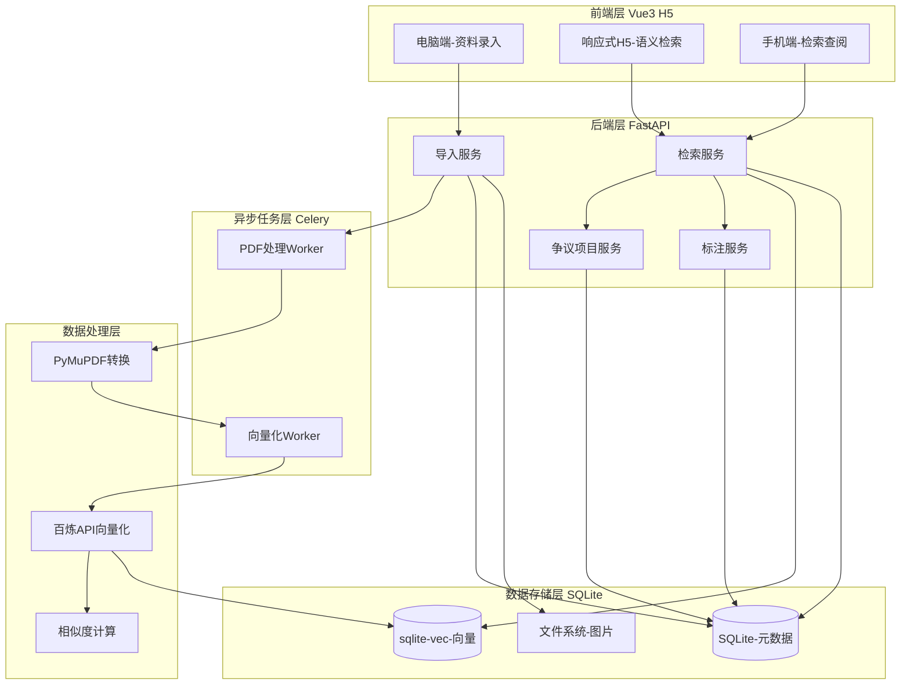
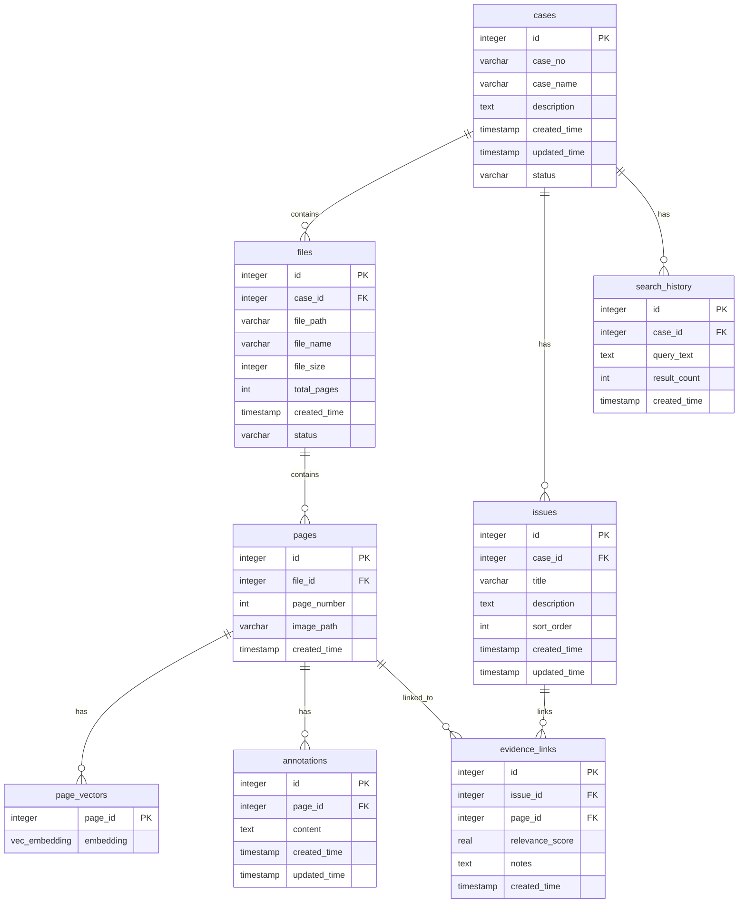
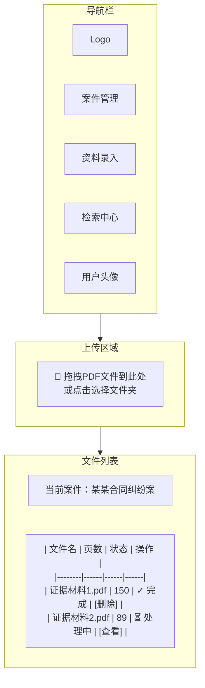
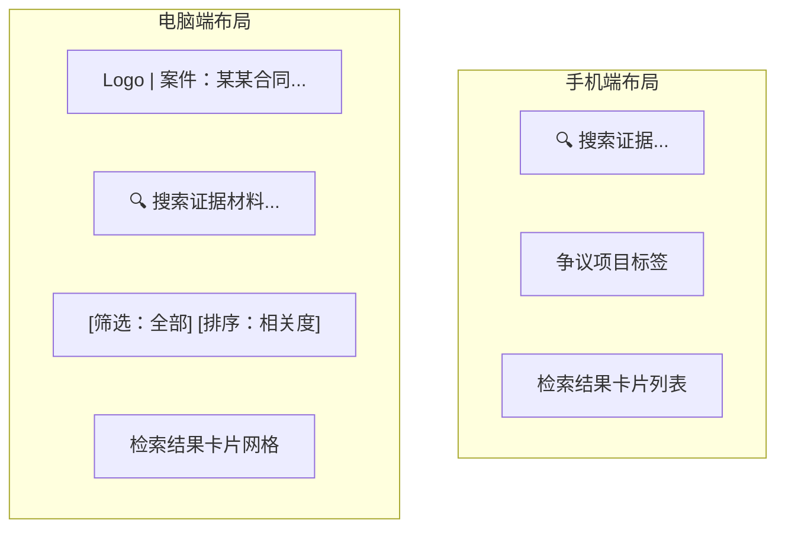

# 专家证人资料检索助手 - PRD

## 1. 项目概述

### 1.1 产品定位
面向法律诉讼场景的专家证人辅助工具，解决海量证据材料（PDF）的快速检索与关联分析问题。

### 1.2 核心价值
- **效率提升**：从人工翻阅千页PDF到秒级智能检索
- **精准定位**：基于语义相似度，而非关键词匹配
- **证据关联**：自动发现与争议项目相关的证据材料

### 1.3 目标用户
- 专家证人（技术/行业专家）
- 代理律师
- 企业法务

### 1.4 终端适配
| 功能模块 | 终端适配 | 说明 |
|---------|---------|------|
| 资料录入 | 仅电脑端 | PDF批量上传、案件管理等管理操作 |
| 语义检索 | 电脑+手机 | 响应式H5设计，随时随地检索查阅 |
| 结果查看 | 电脑+手机 | 页面预览、证据关联查看 |

---

## 2. 功能需求

### 2.1 核心功能

#### 功能1：PDF批量导入与处理
| 需求项 | 描述 |
|--------|------|
| 输入 | 批量PDF文件（支持拖拽/文件夹选择） |
| 处理流程 | PDF → 图片转换 → 向量化 → 数据库存储 |
| 输出 | 建立可检索的向量索引库 |
| 技术方案 | PyMuPDF（DPI=150，PNG格式）+ Celery异步处理 |

#### 功能2：语义检索
| 需求项 | 描述 |
|--------|------|
| 输入 | 自然语言查询（如"合同签署日期相关的证据"） |
| 处理 | 查询向量化 → 相似度计算 → Top-N返回 |
| 输出 | 相关PDF页面列表（含相似度分数） |
| 技术方案 | 阿里云百炼多模态嵌入 + 向量数据库检索 |

#### 功能3：争议项目管理
| 需求项 | 描述 |
|--------|------|
| 功能 | 创建/编辑争议项目清单 |
| 关联 | 每个项目可关联检索到的证据页面 |
| 查看 | 项目-证据关联关系展示 |

#### 功能4：证据标注与笔记
| 需求项 | 描述 |
|--------|------|
| 功能 | 对检索结果添加标注和笔记 |
| 持久化 | 标注数据数据库存储 |

### 2.2 功能优先级

```
P0（MVP核心）
├── PDF批量导入（仅电脑端）
├── 语义检索（H5，兼容手机+电脑）
├── 结果展示（页面预览+页码定位）
└── 争议项目管理

P1（增强体验）
├── 证据标注
└── 检索历史

P2（高级功能）
└── 已移除
```

---

## 3. 技术架构

### 3.1 技术栈选型

| 层级 | 技术选型 | 理由 |
|------|---------|------|
| 前端 | Vue 3 + Vite + 响应式UI框架 | H5开发，跨端适配 |
| 后端 | FastAPI + Python 3.11 | 轻量高效，AI生态丰富，开发速度快 |
| PDF处理 | PyMuPDF (fitz) | 功能强大，性能优异，Python生态最强PDF库 |
| 向量化 | 阿里云百炼 API (qwen3-vl-embedding) | 成本低（千页约0.23元），多模态嵌入 |
| 向量存储 | SQLite + sqlite-vec | 轻量级本地向量检索，零配置 |
| 数据库 | SQLite + SQLAlchemy | 轻量级本地数据库，零配置，单文件存储 |
| 文件存储 | 本地文件系统/MinIO | 图片文件存储 |
| 异步任务 | Celery + Redis | PDF处理异步化，支持进度追踪 |

### 3.2 系统架构



### 3.3 核心数据结构

#### 案件表 (cases) - SQLite
```sql
CREATE TABLE cases (
    id INTEGER PRIMARY KEY AUTOINCREMENT,         -- SQLite 自增主键
    case_no VARCHAR(100) NOT NULL UNIQUE,         -- 案件编号
    case_name VARCHAR(255),                       -- 案件名称
    description TEXT,                             -- 案件描述
    created_time TIMESTAMP DEFAULT CURRENT_TIMESTAMP,
    updated_time TIMESTAMP DEFAULT CURRENT_TIMESTAMP,
    status VARCHAR(20) DEFAULT 'active'           -- active/archived/deleted
);
```

#### 文件表 (files) - SQLite
```sql
CREATE TABLE files (
    id INTEGER PRIMARY KEY AUTOINCREMENT,
    case_id INTEGER NOT NULL REFERENCES cases(id),
    file_path VARCHAR(500) NOT NULL,              -- PDF文件存储路径
    file_name VARCHAR(255) NOT NULL,              -- 文件名
    file_size INTEGER,                            -- 文件大小(字节)
    total_pages INTEGER,                          -- 总页数
    created_time TIMESTAMP DEFAULT CURRENT_TIMESTAMP,
    status VARCHAR(20) DEFAULT 'active'
);
```

#### 页面表 (pages) - SQLite
```sql
CREATE TABLE pages (
    id INTEGER PRIMARY KEY AUTOINCREMENT,
    file_id INTEGER NOT NULL REFERENCES files(id), -- 关联文件
    page_number INTEGER NOT NULL,                  -- 页码（从1开始）
    image_path VARCHAR(500) NOT NULL,              -- 页面图片存储路径
    created_time TIMESTAMP DEFAULT CURRENT_TIMESTAMP,
    UNIQUE(file_id, page_number)
);
```

#### 页面向量表 (page_vectors) - sqlite-vec
```sql
-- 使用 sqlite-vec 扩展存储向量
-- 安装: pip install sqlite-vec
-- 加载扩展后创建虚拟表

CREATE VIRTUAL TABLE page_vectors USING vec0(
    page_id INTEGER PRIMARY KEY,                   -- 关联页面ID
    embedding float[1536]                          -- 向量数据（维度1536）
);

-- 注意：sqlite-vec 自动处理向量索引，无需手动创建
```

#### SQLite 向量检索示例
```sql
-- 向量相似度检索（余弦相似度）
SELECT 
    p.id as page_id,
    p.file_id,
    f.file_name,
    p.page_number,
    vec_distance_cosine(pv.embedding, :query_embedding) as distance
FROM page_vectors pv
JOIN pages p ON pv.page_id = p.id
JOIN files f ON p.file_id = f.id
WHERE f.case_id = :case_id
ORDER BY distance
LIMIT :top_k;
```

#### 争议项目表 (issues) - SQLite
```sql
CREATE TABLE issues (
    id INTEGER PRIMARY KEY AUTOINCREMENT,
    case_id INTEGER NOT NULL REFERENCES cases(id),
    title VARCHAR(500) NOT NULL,                  -- 项目标题
    description TEXT,                             -- 详细描述
    sort_order INTEGER DEFAULT 0,                 -- 排序
    created_time TIMESTAMP DEFAULT CURRENT_TIMESTAMP,
    updated_time TIMESTAMP DEFAULT CURRENT_TIMESTAMP
);
```

#### 证据关联表 (evidence_links) - SQLite
```sql
CREATE TABLE evidence_links (
    id INTEGER PRIMARY KEY AUTOINCREMENT,
    issue_id INTEGER NOT NULL REFERENCES issues(id),
    page_id INTEGER NOT NULL REFERENCES pages(id), -- 关联页面
    relevance_score REAL,                          -- 关联度分数
    notes TEXT,                                    -- 备注
    created_time TIMESTAMP DEFAULT CURRENT_TIMESTAMP,
    UNIQUE(issue_id, page_id)
);
```

#### 检索历史表 (search_history) - SQLite
```sql
CREATE TABLE search_history (
    id INTEGER PRIMARY KEY AUTOINCREMENT,
    case_id INTEGER NOT NULL REFERENCES cases(id),
    query_text TEXT NOT NULL,                     -- 查询文本
    result_count INTEGER,                         -- 结果数量
    created_time TIMESTAMP DEFAULT CURRENT_TIMESTAMP
);
```

#### 标注表 (annotations) - SQLite
```sql
CREATE TABLE annotations (
    id INTEGER PRIMARY KEY AUTOINCREMENT,
    page_id INTEGER NOT NULL REFERENCES pages(id),
    content TEXT NOT NULL,                        -- 标注内容
    created_time TIMESTAMP DEFAULT CURRENT_TIMESTAMP,
    updated_time TIMESTAMP DEFAULT CURRENT_TIMESTAMP
);
```

### 3.4 数据关系图



---

## 4. 接口设计

### 4.1 RESTful API 规范

#### 案件管理接口
```java
// POST /api/cases
// 创建案件
{
    "caseNo": "CASE-2026-001",
    "caseName": "某某合同纠纷案",
    "description": "案件描述"
}

// GET /api/cases
// 获取案件列表

// GET /api/cases/{caseId}
// 获取案件详情
```

#### PDF导入接口
```python
# POST /api/files/upload
# PDF批量上传（仅电脑端）
# Content-Type: multipart/form-data
# FastAPI 自动处理文件上传
@app.post("/api/files/upload")
async def upload_files(
    case_id: int = Form(...),
    files: List[UploadFile] = File(...),
    background_tasks: BackgroundTasks = Depends()
):
    # 异步触发 Celery 任务处理 PDF
    task = process_pdf_batch.delay(case_id, [f.filename for f in files])
    return {"task_id": task.id, "status": "processing"}

# GET /api/files/{file_id}/progress
# 获取导入进度（通过 Celery 任务状态）
@app.get("/api/files/{file_id}/progress")
async def get_progress(file_id: int):
    progress = await get_processing_progress(file_id)
    return {
        "file_id": file_id,
        "total_pages": progress.total_pages,
        "processed_pages": progress.processed_pages,
        "status": progress.status  # pending/processing/completed/failed
    }
```

#### 语义检索接口
```python
# POST /api/search
# 语义检索（H5，兼容手机+电脑）
@app.post("/api/search")
async def semantic_search(request: SearchRequest):
    # 查询向量化
    query_embedding = await embed_text(request.query)
    
    # 向量检索
    results = await vector_search(
        case_id=request.case_id,
        embedding=query_embedding,
        top_k=request.top_k
    )
    
    return {"results": results}

# Pydantic 模型
class SearchRequest(BaseModel):
    case_id: int
    query: str
    top_k: int = 10

class SearchResult(BaseModel):
    page_id: int
    file_id: int
    file_name: str
    page_number: int
    image_url: str
    similarity_score: float
```

#### 争议项目接口
```python
# POST /api/issues
# 创建争议项目
@app.post("/api/issues")
async def create_issue(issue: IssueCreate, db: Session = Depends(get_db)):
    new_issue = Issue(**issue.dict())
    db.add(new_issue)
    db.commit()
    return {"id": new_issue.id}

# POST /api/issues/{issue_id}/evidence
# 关联证据页面
@app.post("/api/issues/{issue_id}/evidence")
async def link_evidence(
    issue_id: int,
    evidence: EvidenceLinkCreate,
    db: Session = Depends(get_db)
):
    link = EvidenceLink(
        issue_id=issue_id,
        page_id=evidence.page_id,
        relevance_score=evidence.relevance_score,
        notes=evidence.notes
    )
    db.add(link)
    db.commit()
    return {"success": True}

# GET /api/issues/{issue_id}/evidence
# 获取项目的证据列表
@app.get("/api/issues/{issue_id}/evidence")
async def get_evidence_links(issue_id: int, db: Session = Depends(get_db)):
    links = db.query(EvidenceLink).filter_by(issue_id=issue_id).all()
    return {"evidence": links}
```

#### 标注接口
```python
# POST /api/pages/{page_id}/annotations
# 添加标注
@app.post("/api/pages/{page_id}/annotations")
async def add_annotation(
    page_id: int,
    annotation: AnnotationCreate,
    db: Session = Depends(get_db)
):
    new_annotation = Annotation(page_id=page_id, content=annotation.content)
    db.add(new_annotation)
    db.commit()
    return {"id": new_annotation.id}

# GET /api/pages/{page_id}/annotations
# 获取页面标注
@app.get("/api/pages/{page_id}/annotations")
async def get_annotations(page_id: int, db: Session = Depends(get_db)):
    annotations = db.query(Annotation).filter_by(page_id=page_id).all()
    return {"annotations": annotations}
```

### 4.2 核心服务设计

#### FileService - 文件处理服务
```python
# services/file_service.py
from sqlalchemy.orm import Session
from celery import Celery

class FileService:
    def __init__(self, db: Session):
        self.db = db
    
    async def batch_upload(self, case_id: int, files: List[UploadFile]) -> List[FileUploadResult]:
        """批量上传PDF文件，触发异步处理任务"""
        results = []
        for file in files:
            # 保存文件
            file_record = await self.save_file(case_id, file)
            # 触发 Celery 异步处理
            task = process_pdf_task.delay(file_record.id)
            results.append(FileUploadResult(
                file_id=file_record.id,
                task_id=task.id,
                status="processing"
            ))
        return results
    
    async def get_progress(self, file_id: int) -> ImportProgress:
        """获取文件处理进度"""
        return await get_processing_status(file_id)

# Celery 异步任务
celery_app = Celery('tasks', broker='redis://localhost:6379/0')

@celery_app.task
def process_pdf_task(file_id: int):
    """异步处理PDF：转换图片 + 向量化"""
    # 1. PyMuPDF 转换PDF页面为图片
    # 2. 调用阿里云百炼API进行向量化
    # 3. 存储向量到 sqlite-vec
    pass
```

#### SearchService - 检索服务
```python
# services/search_service.py
from sqlalchemy.orm import Session
from typing import List

class SearchService:
    def __init__(self, db: Session):
        self.db = db
    
    async def search(self, query: str, case_id: int, top_k: int = 10) -> List[SearchResult]:
        """语义检索主流程"""
        # 1. 查询文本向量化（阿里云百炼API）
        query_embedding = await self.embed_text(query)
        
        # 2. sqlite-vec 向量相似度检索
        results = await self.vector_search(case_id, query_embedding, top_k)
        
        return results
    
    async def embed_text(self, text: str) -> List[float]:
        """调用阿里云百炼多模态嵌入API"""
        # 使用 qwen3-vl-embedding 模型
        response = await call_bailian_embedding(text)
        return response.embedding
    
    async def vector_search(self, case_id: int, embedding: List[float], top_k: int) -> List[SearchResult]:
        """sqlite-vec 向量检索"""
        import sqlite_vec
        
        # 加载 sqlite-vec 扩展
        self.db.enable_load_extension(True)
        sqlite_vec.load(self.db)
        
        sql = """
        SELECT 
            p.id as page_id,
            p.file_id,
            f.file_name,
            p.page_number,
            vec_distance_cosine(pv.embedding, :embedding) as distance
        FROM page_vectors pv
        JOIN pages p ON pv.page_id = p.id
        JOIN files f ON p.file_id = f.id
        WHERE f.case_id = :case_id
        ORDER BY distance
        LIMIT :top_k
        """
        # 执行检索并返回结果
        pass

# Pydantic 模型
class SearchResult(BaseModel):
    page_id: int
    file_id: int
    file_name: str
    page_number: int
    image_url: str
    similarity_score: float  # 1 - distance
```
```

#### IssueService - 争议项目服务
```python
# services/issue_service.py
from sqlalchemy.orm import Session
from typing import List, Optional

class IssueService:
    def __init__(self, db: Session):
        self.db = db
    
    async def create_issue(
        self, 
        case_id: int, 
        title: str, 
        description: Optional[str] = None
    ) -> int:
        """创建争议项目"""
        issue = Issue(
            case_id=case_id,
            title=title,
            description=description
        )
        self.db.add(issue)
        self.db.commit()
        self.db.refresh(issue)
        return issue.id
    
    async def link_evidence(
        self,
        issue_id: int,
        page_id: int,
        relevance_score: float,
        notes: Optional[str] = None
    ) -> None:
        """关联证据页面到争议项目"""
        link = EvidenceLink(
            issue_id=issue_id,
            page_id=page_id,
            relevance_score=relevance_score,
            notes=notes
        )
        self.db.add(link)
        self.db.commit()
    
    async def get_evidence_links(self, issue_id: int) -> List[EvidenceLink]:
        """获取争议项目的证据列表"""
        return self.db.query(EvidenceLink).filter_by(issue_id=issue_id).all()
    
    async def list_issues(self, case_id: int) -> List[Issue]:
        """获取案件的所有争议项目"""
        return self.db.query(Issue).filter_by(case_id=case_id).order_by(Issue.sort_order).all()
```

#### PDF处理工具 - PyMuPDF 实现
```python
# utils/pdf_processor.py
import fitz  # PyMuPDF
from pathlib import Path
from typing import List, Tuple

class PDFProcessor:
    """PDF处理工具类"""
    
    def __init__(self, dpi: int = 150):
        self.dpi = dpi
        self.zoom = dpi / 72  # PDF默认72 DPI
    
    def pdf_to_images(
        self, 
        pdf_path: str, 
        output_dir: str
    ) -> List[Tuple[int, str]]:
        """
        将PDF转换为图片
        
        Returns:
            List[Tuple[int, str]]: [(页码, 图片路径), ...]
        """
        doc = fitz.open(pdf_path)
        images = []
        
        for page_num in range(len(doc)):
            page = doc[page_num]
            
            # 设置缩放矩阵
            mat = fitz.Matrix(self.zoom, self.zoom)
            pix = page.get_pixmap(matrix=mat)
            
            # 保存图片
            output_path = Path(output_dir) / f"page_{page_num + 1}.png"
            pix.save(str(output_path))
            images.append((page_num + 1, str(output_path)))
            
            pix = None  # 释放内存
        
        doc.close()
        return images
    
    def extract_text(self, pdf_path: str) -> List[Tuple[int, str]]:
        """提取PDF每页的文本内容"""
        doc = fitz.open(pdf_path)
        texts = []
        
        for page_num in range(len(doc)):
            page = doc[page_num]
            text = page.get_text()
            texts.append((page_num + 1, text))
        
        doc.close()
        return texts

#### PDF内存优化策略

##### 内存消耗分析
| 场景 | 内存占用 | 说明 |
|------|----------|------|
| 打开 PDF | 文件大小 × 2-3 倍 | 100MB PDF ≈ 200-300MB |
| 转图片 (DPI=150) | 页面数 × 单页内存 | 100页 ≈ 100-200MB |
| 并发处理 | 线性增长 | 同时处理 N 个文件就 ×N |

##### 优化方案1：流式处理（逐页处理）
```python
# utils/pdf_processor.py
import fitz
import gc
from pathlib import Path

class PDFProcessor:
    def __init__(self, dpi: int = 150):
        self.dpi = dpi
        self.zoom = dpi / 72
    
    def process_pdf_streaming(
        self, 
        pdf_path: str, 
        output_dir: str, 
        callback=None
    ) -> int:
        """
        流式处理：逐页转换，处理完一页释放一页
        内存占用 = 单页最大内存，而非整个PDF
        
        Args:
            pdf_path: PDF文件路径
            output_dir: 输出目录
            callback: 进度回调函数 (current, total) -> None
        
        Returns:
            处理的总页数
        """
        doc = fitz.open(pdf_path)
        total_pages = len(doc)
        
        for page_num in range(total_pages):
            page = doc[page_num]
            
            # 转换单页
            mat = fitz.Matrix(self.zoom, self.zoom)
            pix = page.get_pixmap(matrix=mat)
            
            # 保存
            output_path = Path(output_dir) / f"page_{page_num + 1}.png"
            pix.save(str(output_path))
            
            # 关键：立即释放内存
            pix = None
            page = None
            
            # 强制垃圾回收（大PDF时很重要）
            if page_num % 10 == 0:
                gc.collect()
            
            # 进度回调
            if callback:
                callback(page_num + 1, total_pages)
        
        doc.close()
        gc.collect()
        return total_pages
```

##### 优化方案2：Celery并发控制
```python
# celery_worker.py
from celery import Celery
from celery.signals import worker_process_init

# 关键：限制并发，避免内存爆炸
celery_app = Celery('tasks', broker='redis://localhost:6379/0')

celery_app.conf.update(
    worker_concurrency=1,          # 同时只处理1个PDF
    task_acks_late=True,           # 处理完才确认，失败可重试
    worker_prefetch_multiplier=1,  # 只预取1个任务
    task_time_limit=1800,          # 单任务30分钟超时
    task_soft_time_limit=1500,     # 软限制25分钟
)

@worker_process_init.connect
def init_worker(**kwargs):
    """Worker启动时初始化"""
    import gc
    gc.set_threshold(700, 10, 10)  # 调整GC阈值

@celery_app.task(bind=True, max_retries=3)
def process_pdf_task(self, file_id: int):
    """带重试机制的PDF处理任务"""
    try:
        processor = PDFProcessor(dpi=150)
        # 流式处理...
        return {"status": "success", "file_id": file_id}
    except Exception as exc:
        # 失败重试，60秒后重试
        raise self.retry(exc=exc, countdown=60)
```

##### 优化方案3：系统级内存保护
```python
# config.py
import os
import psutil

class PDFConfig:
    """PDF处理配置"""
    
    # 图像质量参数
    DPI = 150                    # 默认DPI，平衡清晰度与内存
    DPI_LOW = 100               # 内存紧张时使用
    DPI_MIN = 72                # 最低，仅预览
    
    # 内存限制参数
    MAX_CONCURRENT_PDFS = 1     # 同时只处理1个PDF
    MAX_PDF_SIZE_MB = 100       # 限制单文件100MB
    MAX_PAGES_PER_BATCH = 50    # 超50页分批处理
    MAX_MEMORY_PERCENT = 70     # 系统内存使用超70%暂停处理
    
    # 单页最大尺寸限制（防止异常大页面）
    MAX_PAGE_WIDTH = 5000       # 最大宽度像素
    MAX_PAGE_HEIGHT = 5000      # 最大高度像素

class MemoryMonitor:
    """内存监控器"""
    
    @staticmethod
    def get_memory_usage() -> float:
        """获取当前内存使用百分比"""
        return psutil.virtual_memory().percent
    
    @staticmethod
    def can_start_processing() -> bool:
        """检查是否可以开始新的PDF处理"""
        return MemoryMonitor.get_memory_usage() < PDFConfig.MAX_MEMORY_PERCENT
    
    @staticmethod
    def wait_if_memory_high():
        """内存过高时等待"""
        import time
        while not MemoryMonitor.can_start_processing():
            time.sleep(5)  # 等待5秒再检查
```

##### 优化方案4：大PDF分批处理
```python
# utils/pdf_processor.py

def process_large_pdf(
    self, 
    pdf_path: str, 
    output_dir: str,
    batch_size: int = 50
) -> int:
    """
    大PDF分批处理，每批处理后释放内存
    
    Args:
        batch_size: 每批处理的页数
    """
    doc = fitz.open(pdf_path)
    total_pages = len(doc)
    processed = 0
    
    # 分批处理
    for batch_start in range(0, total_pages, batch_size):
        batch_end = min(batch_start + batch_size, total_pages)
        
        for page_num in range(batch_start, batch_end):
            page = doc[page_num]
            # ... 处理单页 ...
            processed += 1
        
        # 每批结束强制GC
        gc.collect()
        
        # 检查内存，过高则等待
        if not MemoryMonitor.can_start_processing():
            MemoryMonitor.wait_if_memory_high()
    
    doc.close()
    gc.collect()
    return processed
```

##### 实际内存预估
| PDF 大小 | 页数 | 优化前内存 | 优化后内存 |
|----------|------|-----------|-----------|
| 10MB | 50页 | ~200MB | ~50MB |
| 50MB | 200页 | ~800MB | ~100MB |
| 100MB | 500页 | ~2GB | ~200MB |

##### 服务器适配建议（1.6G内存）
```python
# 生产环境配置
PRODUCTION_CONFIG = {
    "MAX_CONCURRENT_PDFS": 1,      # 同时只处理1个
    "MAX_PDF_SIZE_MB": 100,        # 限制单文件100MB
    "MAX_PAGES_PER_BATCH": 50,     # 分批处理
    "DPI": 150,                    # 平衡质量与内存
    "MAX_MEMORY_PERCENT": 70,      # 内存阈值70%
}

# 预期内存占用
# - 系统基础: ~750MB (已有)
# - 应用运行: ~200MB
# - PDF处理峰值: ~300MB
# - 预留缓冲: ~300MB
# 总计: ~1.3GB < 1.6GB (安全)
```

---

## 5. 前端设计

### 5.1 技术选型

| 技术 | 选型 | 说明 |
|------|------|------|
| 框架 | Vue 3 + Composition API | 现代化响应式框架 |
| 构建工具 | Vite | 快速开发体验 |
| UI组件库 | Element Plus / Ant Design Vue | 企业级组件库 |
| 样式 | Tailwind CSS + SCSS | 原子化CSS + 预处理器 |
| 状态管理 | Pinia | 轻量级状态管理 |
| 路由 | Vue Router 4 | 单页应用路由 |
| HTTP客户端 | Axios | HTTP请求库 |

### 5.2 页面设计

#### 电脑端 - 资料录入页



#### 响应式H5 - 检索页（手机+电脑通用）



### 5.3 高级感设计规范

#### 色彩方案
```css
/* 主色调 - 深蓝灰，专业稳重 */
--primary-900: #0f172a;
--primary-800: #1e293b;
--primary-700: #334155;
--primary-600: #475569;
--primary-500: #64748b;

/* 强调色 - 金色，法律高端感 */
--accent-500: #d4af37;
--accent-400: #e4c158;
--accent-300: #f0d78c;

/* 背景色 */
--bg-primary: #ffffff;
--bg-secondary: #f8fafc;
--bg-tertiary: #f1f5f9;

/* 文字色 */
--text-primary: #0f172a;
--text-secondary: #475569;
--text-tertiary: #94a3b8;
```

#### 字体规范
```css
/* 标题字体 */
font-family: 'Noto Serif SC', 'Source Han Serif SC', serif;

/* 正文字体 */
font-family: 'Inter', 'Noto Sans SC', -apple-system, sans-serif;

/* 字号 */
--text-xs: 0.75rem;      /* 12px - 辅助文字 */
--text-sm: 0.875rem;     /* 14px - 正文 */
--text-base: 1rem;       /* 16px - 标准 */
--text-lg: 1.125rem;     /* 18px - 小标题 */
--text-xl: 1.25rem;      /* 20px - 标题 */
--text-2xl: 1.5rem;      /* 24px - 大标题 */
```

#### 交互效果
- 卡片悬停：轻微上浮 + 阴影加深
- 按钮点击：缩放0.98 + 涟漪效果
- 页面切换：淡入淡出过渡
- 加载状态：骨架屏 + 渐进式加载

---

## 6. 非功能需求

### 6.1 性能指标

| 指标 | 目标值 | 说明 |
|------|--------|------|
| PDF导入速度 | 10页/秒 | 含转换+向量化 |
| 检索响应时间 | <2秒 | 百万级向量数据 |
| 页面加载时间 | <3秒 | 首屏加载 |
| 图片加载时间 | <1秒 | 页面预览图片 |

### 6.2 可靠性

- **数据安全**：所有数据本地存储，不上传云端（除向量化API调用）
- **备份机制**：数据库定期自动备份
- **异常恢复**：导入任务断点续传

### 6.3 兼容性

| 设备/浏览器 | 支持情况 |
|------------|---------|
| Chrome/Edge | 完全支持 |
| Safari | 完全支持 |
| Firefox | 完全支持 |
| iOS Safari | 完全支持 |
| Android Chrome | 完全支持 |
| 微信内置浏览器 | 完全支持 |

---

## 7. 文件存储方案

### 7.1 存储架构

```
project_root/
├── data/
│   └── expert.db              # SQLite 数据库
├── storage/
│   ├── pdfs/                  # 原始PDF文件
│   │   └── {case_id}/
│   │       └── {file_id}_{filename}.pdf
│   └── images/                # 转换后的页面图片
│       └── {case_id}/
│           └── {file_id}/
│               └── page_{page_number}.png
└── temp/                      # 临时文件（定期清理）
    └── upload/
```

### 7.2 存储配置

```python
# config/storage.py
from pathlib import Path

class StorageConfig:
    """本地存储配置"""
    
    # 基础路径
    BASE_DIR = Path(__file__).parent.parent
    
    # 存储目录
    STORAGE_DIR = BASE_DIR / "storage"
    PDF_DIR = STORAGE_DIR / "pdfs"
    IMAGE_DIR = STORAGE_DIR / "images"
    TEMP_DIR = BASE_DIR / "temp" / "upload"
    
    # 文件限制
    MAX_PDF_SIZE = 100 * 1024 * 1024  # 100MB
    MAX_IMAGE_SIZE = 10 * 1024 * 1024  # 10MB
    ALLOWED_PDF_TYPES = {".pdf"}
    ALLOWED_IMAGE_TYPES = {".png", ".jpg", ".jpeg"}
    
    # 图片转换参数
    IMAGE_DPI = 150
    IMAGE_FORMAT = "png"
    IMAGE_QUALITY = 85
    
    @classmethod
    def ensure_dirs(cls):
        """确保所有目录存在"""
        cls.PDF_DIR.mkdir(parents=True, exist_ok=True)
        cls.IMAGE_DIR.mkdir(parents=True, exist_ok=True)
        cls.TEMP_DIR.mkdir(parents=True, exist_ok=True)
```

### 7.3 文件存储服务

```python
# services/storage_service.py
import shutil
import hashlib
from pathlib import Path
from typing import Optional
from fastapi import UploadFile

class StorageService:
    """本地文件存储服务"""
    
    def __init__(self):
        self.config = StorageConfig()
        self.config.ensure_dirs()
    
    async def save_pdf(
        self, 
        case_id: int, 
        file: UploadFile
    ) -> tuple[int, str]:
        """
        保存PDF文件到本地存储
        
        Args:
            case_id: 案件ID
            file: 上传的文件
        
        Returns:
            (file_id, file_path): 文件ID和存储路径
        """
        # 生成文件ID（使用时间戳+随机数）
        import time
        import random
        file_id = int(time.time() * 1000) + random.randint(1000, 9999)
        
        # 构建存储路径
        case_dir = self.config.PDF_DIR / str(case_id)
        case_dir.mkdir(parents=True, exist_ok=True)
        
        # 文件名：{file_id}_{原始文件名}
        safe_filename = self._sanitize_filename(file.filename)
        filename = f"{file_id}_{safe_filename}"
        file_path = case_dir / filename
        
        # 保存文件
        with open(file_path, "wb") as buffer:
            shutil.copyfileobj(file.file, buffer)
        
        return file_id, str(file_path.relative_to(self.config.BASE_DIR))
    
    def save_page_image(
        self, 
        case_id: int, 
        file_id: int, 
        page_number: int, 
        image_data: bytes
    ) -> str:
        """
        保存页面图片
        
        Args:
            case_id: 案件ID
            file_id: 文件ID
            page_number: 页码
            image_data: 图片二进制数据
        
        Returns:
            图片存储路径
        """
        # 构建路径：storage/images/{case_id}/{file_id}/page_{n}.png
        image_dir = self.config.IMAGE_DIR / str(case_id) / str(file_id)
        image_dir.mkdir(parents=True, exist_ok=True)
        
        image_path = image_dir / f"page_{page_number}.png"
        
        with open(image_path, "wb") as f:
            f.write(image_data)
        
        return str(image_path.relative_to(self.config.BASE_DIR))
    
    def get_pdf_path(self, case_id: int, file_id: int, filename: str) -> Path:
        """获取PDF文件路径"""
        return self.config.PDF_DIR / str(case_id) / f"{file_id}_{filename}"
    
    def get_image_path(
        self, 
        case_id: int, 
        file_id: int, 
        page_number: int
    ) -> Path:
        """获取页面图片路径"""
        return (
            self.config.IMAGE_DIR / 
            str(case_id) / 
            str(file_id) / 
            f"page_{page_number}.png"
        )
    
    def delete_case_files(self, case_id: int) -> bool:
        """删除案件的所有文件"""
        try:
            # 删除PDF
            pdf_dir = self.config.PDF_DIR / str(case_id)
            if pdf_dir.exists():
                shutil.rmtree(pdf_dir)
            
            # 删除图片
            image_dir = self.config.IMAGE_DIR / str(case_id)
            if image_dir.exists():
                shutil.rmtree(image_dir)
            
            return True
        except Exception:
            return False
    
    def _sanitize_filename(self, filename: str) -> str:
        """清理文件名，移除危险字符"""
        import re
        # 保留字母、数字、中文、常见符号
        filename = re.sub(r'[^\w\u4e00-\u9fa5.-]', '_', filename)
        # 限制长度
        if len(filename) > 100:
            name, ext = Path(filename).stem, Path(filename).suffix
            filename = name[:100 - len(ext)] + ext
        return filename
```

### 7.4 文件访问接口

```python
# routers/files.py
from fastapi import APIRouter, HTTPException
from fastapi.responses import FileResponse

router = APIRouter(prefix="/api/files")

@router.get("/pdfs/{case_id}/{file_id}")
async def get_pdf(case_id: int, file_id: int):
    """获取PDF文件"""
    storage = StorageService()
    
    # 从数据库获取文件名
    file_record = await get_file_record(file_id)
    if not file_record:
        raise HTTPException(status_code=404, detail="文件不存在")
    
    file_path = storage.get_pdf_path(case_id, file_id, file_record.file_name)
    
    if not file_path.exists():
        raise HTTPException(status_code=404, detail="文件已丢失")
    
    return FileResponse(
        path=file_path,
        filename=file_record.file_name,
        media_type="application/pdf"
    )

@router.get("/images/{case_id}/{file_id}/{page_number}")
async def get_page_image(case_id: int, file_id: int, page_number: int):
    """获取页面图片"""
    storage = StorageService()
    
    image_path = storage.get_image_path(case_id, file_id, page_number)
    
    if not image_path.exists():
        raise HTTPException(status_code=404, detail="图片不存在")
    
    return FileResponse(
        path=image_path,
        media_type="image/png"
    )
```

### 7.5 存储空间管理

```python
# services/cleanup_service.py
import shutil
from datetime import datetime, timedelta

class CleanupService:
    """存储清理服务"""
    
    def __init__(self):
        self.config = StorageConfig()
    
    def clean_temp_files(self, max_age_hours: int = 24):
        """清理临时文件"""
        cutoff = datetime.now() - timedelta(hours=max_age_hours)
        
        for file_path in self.config.TEMP_DIR.rglob("*"):
            if file_path.is_file():
                mtime = datetime.fromtimestamp(file_path.stat().st_mtime)
                if mtime < cutoff:
                    file_path.unlink()
    
    def get_storage_stats(self) -> dict:
        """获取存储统计"""
        def get_dir_size(path: Path) -> int:
            total = 0
            for file in path.rglob("*"):
                if file.is_file():
                    total += file.stat().st_size
            return total
        
        return {
            "pdf_size_mb": get_dir_size(self.config.PDF_DIR) / 1024 / 1024,
            "image_size_mb": get_dir_size(self.config.IMAGE_DIR) / 1024 / 1024,
            "temp_size_mb": get_dir_size(self.config.TEMP_DIR) / 1024 / 1024,
        }
```

### 7.6 Docker 卷映射

```dockerfile
# Dockerfile 中配置卷
VOLUME ["/app/data", "/app/storage", "/app/temp"]
```

```yaml
# docker-compose.yml
version: '3.8'
services:
  api:
    build: .
    volumes:
      - ./data:/app/data           # 数据库持久化
      - ./storage:/app/storage     # 文件存储持久化
      - ./temp:/app/temp           # 临时文件
    environment:
      - STORAGE_DIR=/app/storage
      - DATABASE_URL=/app/data/expert.db
```

---

## 8. 附录

### 8.1 技术参考
- [Vue 3 文档](https://vuejs.org/)
- [FastAPI 文档](https://fastapi.tiangolo.com/)
- [SQLAlchemy 文档](https://docs.sqlalchemy.org/)
- [PyMuPDF 文档](https://pymupdf.readthedocs.io/)
- [Celery 文档](https://docs.celeryq.dev/)
- [阿里云百炼多模态嵌入API](https://help.aliyun.com/zh/model-studio/developer-reference/multimodal-embedding-api-reference)
- [sqlite-vec文档](https://github.com/asg017/sqlite-vec)

---

## 更新记录

| 日期 | 版本 | 变更内容 |
|------|------|---------|
| 2026-04-16 | 1.0 | 初始版本，确定MVP功能与技术方案 |
| 2026-04-16 | 1.1 | 调整技术栈：前端改为Vue3 H5，后端改为SpringBoot；移除P2功能；调整数据架构 |
| 2026-04-16 | 1.2 | "争议焦点"改名为"争议项目"；focus_points表改为issues表；FocusPointService改为IssueService；所有图表改为mermaid格式 |
| 2026-04-16 | 1.3 | 后端技术栈从Spring Boot改为FastAPI+Python；PDF处理从PDFBox改为PyMuPDF；增加Celery异步任务处理 |
| 2026-04-16 | 1.4 | 数据库从PostgreSQL改为SQLite；向量存储从pgvector改为sqlite-vec；简化部署，零配置启动 |
