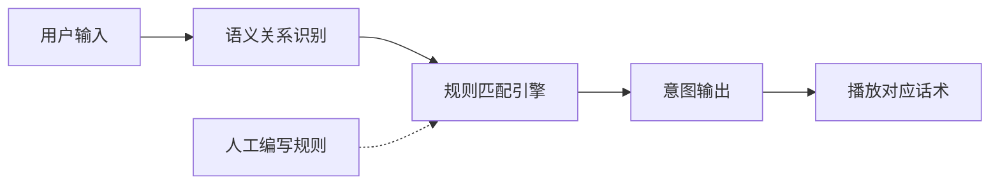
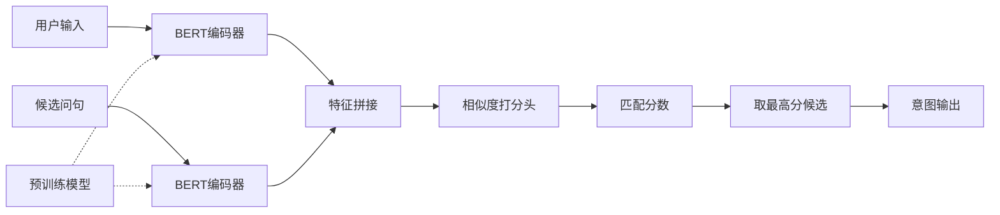
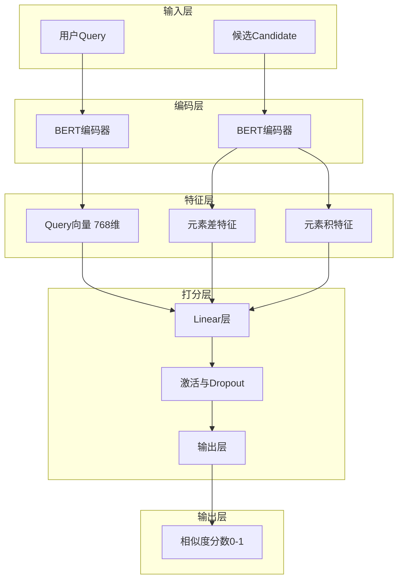
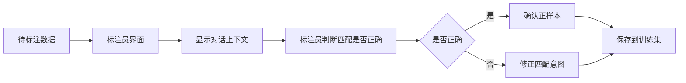
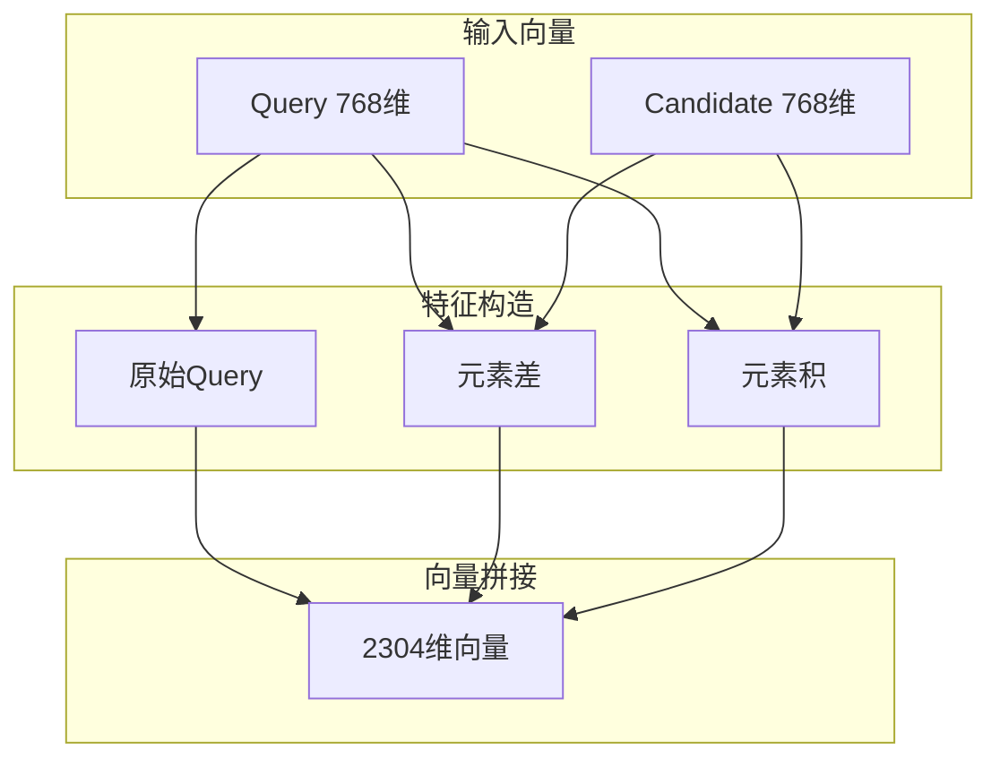
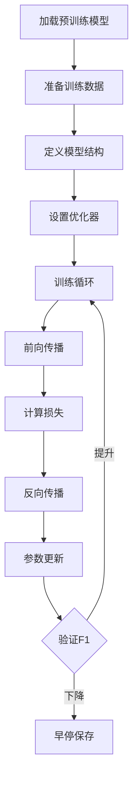
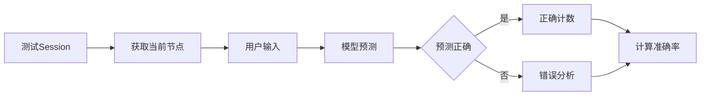
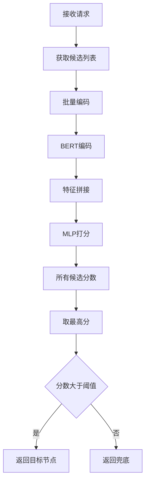
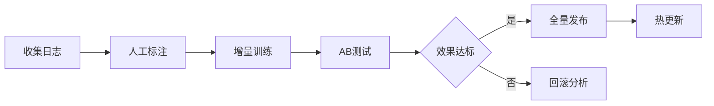

## 人马科技 - BERT语义匹配系统改造 PRD

### 1. 项目背景与目标

#### 1.1 现状问题

人马科技原有外呼机器人系统基于规则引擎实现意图识别，存在以下痛点：

- 新场景上线周期长（平均2-3周）
- 规则维护成本高，存在规则冲突
- 对口语化、变体表达识别准确率低

#### 1.2 项目目标

将规则系统改造为基于BERT的语义匹配系统，实现：

- 意图识别准确率从72%提升至90%+
- 新场景上线周期缩短至3天内
- 降低规则维护人力成本60%

***

### 2. 业务场景说明

#### 2.1 外呼对话流程示例（游戏推广场景）

以91玩传奇手游老玩家召回为例，展示用户在不同节点的意图识别：

**节点1-1：开场白**

- 客服：您好，我这边是传奇手游91玩平台的客服小妹
- 用户可能的回复：
  - "喂" / "你好" / "您好" → 跳转到节点1-2
  - "哪里" / "哪位" → 跳转到节点1-2

**节点1-2：确认身份**

- 客服：咱们系统显示您之前有玩过我们传奇手游91玩的，您还有印象吗？
- 用户可能的回复：
  - "有印象" / "玩过" / "怎么了" → 跳转到节点1-3
  - "没有" / "不记得" → 跳转到节点1-3
  - "什么事" → 跳转到节点1-3

**节点1-3：介绍活动**

- 客服：为了答谢老玩家，我们平台近期推出了老玩家回归福利，充值给到50%现金红包返现...
- 用户可能的回复：
  - "好的" / "行" / "可以" / "OK" → 跳转到节点1-5（同意参与）
  - "什么活动" / "怎么领取" / "什么福利" → 跳转到节点1-5（继续介绍）
  - "不需要" / "没兴趣" / "不用了" → 跳转到节点1-4（挽留）
  - "已卸载" / "不玩了" → 跳转到节点1-3（重新引导）

**节点1-4：挽留**

- 客服：您先别着急拒绝，我们平台有1000多款热门手游供您选择...
- 用户可能的回复：
  - "我同意了" / "那看看" → 跳转到节点1-5（同意参与）
  - "你是垃圾" / "报警了" → 跳转到节点1-8（结束）

**节点1-5：确认参与**

- 客服：稍后我会把福利活动链接通过短信发送到您手机上，您点击链接即可选择...
- 用户可能的回复：
  - "你是对的" / "好的" / "嗯" → 跳转到节点1-6（礼貌结束）
  - "否定" / "不回答" / "草泥马" → 跳转到节点1-8（结束）

#### 2.2 核心需求

用户在每个对话节点说出任意话语，系统需识别其意图并跳转到正确的下一个节点。每个节点通常有4-6个分支意图。

***

### 3. 技术方案

#### 3.1 架构对比

**原规则系统架构**



规则示例：

- 规则1: (包含"好" OR 包含"行") AND 节点="1-3" → 跳转1-5
- 规则2: (包含"不需要" OR 包含"没兴趣") AND 节点="1-3" → 跳转1-4

**BERT语义匹配系统架构（交互式精排）**



#### 3.2 方案选型说明

**为什么采用精排而非向量召回？**

| 对比维度 | 向量召回           | 交互式精排         |
| :--- | :------------- | :------------ |
| 候选数量 | 适合大规模候选(1000+) | 适合小规模候选(4-6个) |
| 交互能力 | 弱（仅余弦相似度）      | 强（可学习复杂匹配模式）  |
| 推理延迟 | 向量检索快          | 6次前向传播小于50ms  |
| 适用场景 | 检索、推荐          | 对话意图识别        |

**结论**：对话场景下每个节点仅4-6个候选分支，精排可直接建模query与candidate的交互关系，效果更优。

#### 3.3 模型架构

**基础模型**：`chinese-roberta-wwm-ext`（哈工大中文全词掩码RoBERTa）

选择理由：

- 中文语境下效果优于原生BERT
- 全词掩码策略更适合中文语义理解
- 模型大小适中（102M参数）

**双塔交互式精排架构**



**特征拼接说明**：

- Query向量：768维
- 元素差：|Query - Candidate|，差异特征
- 元素积：Query \* Candidate，共现特征
- 拼接后：2304维输入MLP

***

### 4. 数据处理流程

#### 4.1 数据来源与两阶段建模策略

**阶段一：通用意图识别基座模型**

公司原有业务以**互动小说**为主，保险营销数据虽多但利用率低。

**数据资产盘点（2023年6月）**

| 业务线      | 原始数据量  | 有效数据量      | 数据质量 | 用途     |
| :------- | :----- | :--------- | :--- | :----- |
| 互动小说     | 约12万条  | 约5万条       | 高    | 基座模型主力 |
| 保险营销     | 约15万条  | 约5000条     | 低    | 仅简单意图  |
| 91玩游戏推广  | 约8000条 | 约3000条     | 中    | 外呼场景微调 |
| **合计可用** | -      | **约5.8万条** | -    | -      |

**为什么保险数据利用率低？**

保险营销以**单向通知**为主（"您的保单已生效"），90%用户几乎不回应，仅2%有有效交互（询问详情、拒绝等）。

**数据困境与解决思路**

| 问题       | 实际情况                 | 解决方案                 |
| :------- | :------------------- | :------------------- |
| 外呼数据少    | 只有91玩一个外呼客户，数据仅3000条 | 用互动小说5万条数据补充通用意图识别能力 |
| 场景差异大    | 小说是语音交互选择剧情，外呼是口语对话   | 抽象底层意图：同意/拒绝/询问/确认   |
| 保险数据多但无用 | 通知型，用户几乎不回应          | 仅用于训练"确认收到"类简单意图     |

**阶段二：新领域快速适配**

基于互动小说基座模型，外呼场景通过少量数据微调：

| 适配阶段 | 数据量          | 效果      | 周期    |
| :--- | :----------- | :------ | :---- |
| 冷启动  | 500-1000条    | 70%+准确率 | 1周内上线 |
| 迭代优化 | 累计2000-3000条 | 82%+准确率 | 2-3周  |
| 深度优化 | 累计5000条+     | 88%+准确率 | 1-2个月 |

**91玩项目示例**

- 基座模型：互动小说5万条 + 保险通知筛选后5000条
- 冷启动：91玩场景800条样本 → 5天达到72%准确率上线
- 迭代优化：1个月累计收集2500条 → 准确率提升至85.3%

**为什么互动小说能支撑外呼场景？**

| 能力     | 互动小说已具备           | 外呼场景需补充     |
| :----- | :---------------- | :---------- |
| 意图识别框架 | 用户语音回答→剧情跳转，本质是意图匹配 | 相同框架        |
| 通用意图   | 继续/放弃/询问详情/选择分支   | 同意/拒绝/询问/确认 |
| 口语化理解  | 网络用语、简略表达         | 电话口语、语气词    |
| 领域知识   | 小说剧情、角色名          | 游戏术语、活动名称   |

***

### 4.2 数据采集与清洗流程

**原始数据格式示例**

互动小说数据（语音交互）：

```json
{
  "session_id": "novel_20230615_001",
  "scene": "interactive_novel",
  "chapter_id": "ch3_branch2",
  "bot_speak": "神秘人向你发出邀请，你会选择接受还是拒绝？",
  "user_input": "接受邀请",
  "asr_confidence": 0.92,
  "matched_branch": "branch_A",
  "timestamp": "2023-06-15 14:23:45"
}
```

保险营销数据：

```json
{
  "session_id": "insurance_20230615_001",
  "scene": "insurance_notification",
  "call_type": "保单到期提醒",
  "user_response": "知道了",
  "timestamp": "2023-06-15 10:30:00"
}
```

***

### 4.3 数据清洗与工程流程

#### 第一步：分场景抽取

**互动小说数据抽取**

```sql
SELECT * FROM novel_logs 
WHERE timestamp BETWEEN '2023-01-01' AND '2023-06-30'
AND user_input IS NOT NULL
AND chapter_id IN (
  SELECT chapter_id FROM chapters 
  WHERE has_branch = 1  -- 只取有分支的章节
)
```

**抽取结果**：约12万条 → 清洗后5万条有效

**保险数据筛选**

```sql
SELECT * FROM insurance_logs 
WHERE user_response NOT IN ('', '嗯', '好的', '知道了')
AND LENGTH(user_response) > 5
```

**抽取结果**：约15万条 → 仅5000条有实际交互价值

#### 第二步：数据清洗

**互动小说数据清洗**


**清洗规则**

| 清洗步骤   | 规则        | 示例            | 剩余   |
| :----- | :-------- | :------------ | :--- |
| ASR错误过滤 | 置信度<0.7 | "接受"识别成"鸡兽" | 9.5万 |
| 长度过滤   | 用户输入<2字符  | "A"、"1"       | 8.2万 |
| 去重     | 同章节同回答    | 用户重复说同一句话      | 6.8万 |
| 人工校验   | 模糊意图标注    | "再看看"是继续还是放弃？ | 5万   |

**典型清洗案例**

**案例1：互动小说意图模糊**

- 场景：主角遇到神秘人
- 用户语音回答："再看看"
- 问题：这是"继续观察"还是"拒绝互动"？
- 处理：人工标注为"拖延/犹豫"，单独分类

**案例2：保险数据筛选**

- 原始：用户说"知道了"
- 处理：属于简单确认，无多轮对话价值，丢弃
- 保留：用户说"这个保险具体保什么？"（有询问意图）

#### 第三步：样本构建

**互动小说样本（用于基座模型）**

```
query = 用户语音转文本（如"接受邀请"）
candidate = 分支描述（如"接受"、"拒绝"、"询问"）
label = 1（匹配）或 0（不匹配）
```

**示例**

| 章节场景  | 用户语音回答   | 匹配分支 | label |
| :---- | :--------- | :--- | :---- |
| 神秘人邀请 | "接受邀请"   | 接受   | 1     |
| 神秘人邀请 | "接受邀请"   | 拒绝   | 0     |
| 神秘人邀请 | "我想了解一下" | 询问   | 1     |
| 神秘人邀请 | "我想了解一下" | 接受   | 0     |

**91玩外呼样本（用于微调）**

```
query = 用户语音转文本（如"什么活动啊"）
candidate = 节点意图（如"询问活动"、"同意"、"拒绝"）
label = 1 或 0
```

**最终样本分布**

| 数据来源    | 正样本       | 负样本       | 合计       | 用途     |
| :------ | :-------- | :-------- | :------- | :----- |
| 互动小说    | 2万        | 3万        | 5万       | 基座模型训练 |
| 保险（筛选后） | 2000      | 3000      | 5000     | 补充简单意图 |
| 91玩游戏推广 | 1200      | 1800      | 3000     | 外呼场景微调 |
| **总计**  | **2.32万** | **3.48万** | **5.8万** | -      |

***

### 4.4 数据标注工具与流程

**自研标注平台功能**



**标注界面示例**

```
会话ID: 20230615_001A
当前节点: 1-3 (介绍活动)
客服话术: "为了答谢老玩家，我们平台近期推出了老玩家回归福利..."
用户输入: "什么活动啊"

系统匹配结果: 询问活动 → 跳转到节点1-5

[ ] 匹配正确
[x] 匹配错误，正确意图应该是: [询问活动/同意参与/拒绝/已卸载]

标注员备注: ___________
```

**标注效率**

- 熟练标注员：每小时可标注200-300条
- 2名标注员1周可完成3000条数据标注

***

### 5. 特征工程

#### 5.1 文本预处理流程


预处理规则：

- 统一标点：全角转半角
- 口语化归一：神马→什么，木有→没有
- 去重：好好好→好
- 过滤语气词：啊、呢、吧、吗

#### 5.2 数据乱来场景与处理规则

**电话外呼场景的"乱数据"类型**

| 乱数据类型 | 占比 | 示例 | 处理规则 |
|:-----------|:-----|:-----|:---------|
| **ASR识别错误** | 15% | "传奇手游"→"船骑手油" | 置信度<0.7直接丢弃 |
| **用户无回应** | 20% | "" / "[静音]" / "喂喂喂" | 过滤空值和纯语气词 |
| **背景噪音** | 5% | "你说什么"（环境嘈杂） | 结合通话时长过滤 |
| **用户反问** | 8% | "你是谁啊" / "打错了吧" | 标注为"确认身份"意图 |
| **情绪发泄** | 3% | "别再打来了！" / "烦不烦" | 标注为"强烈拒绝" |
| **无关对话** | 2% | "我在开车" / "现在不方便" | 标注为"延迟/改期" |
| **方言口音** | 5% | "中"（河南同意）/ "要得"（四川同意） | 方言词表归一化 |
| **网络用语** | 10% | "yyds" / "绝绝子" / "666" | 网络词表映射 |
| **重复输入** | 7% | "什么什么什么活动" | 重复字符去重 |
| **超长输入** | 3% | 用户说了一大段话 | 截断至50字符 |

**互动小说场景的"乱数据"类型（语音交互）**

| 乱数据类型 | 占比 | 示例 | 处理规则 |
|:-----------|:-----|:-----|:---------|
| **ASR识别错误** | 15% | "拒绝"识别成"巨绝" | 置信度<0.7丢弃 |
| **用户无回应** | 18% | 静音、环境噪音 | 过滤空值和杂音 |
| **随意回答** | 10% | "随便" / "都行" / "你决定" | 映射到"默认继续" |
| **跳章阅读** | 8% | 用户说"跳过""快进" | 过滤上下文不连贯样本 |
| **重复回答** | 12% | 用户反复说同一句话 | 去重保留最后一次 |
| **异常退出** | 5% | 回答后未进入下一章 | 过滤不完整会话 |
| **测试数据** | 3% | 内部测试产生的录音 | 按设备ID过滤 |

**保险营销场景的"乱数据"类型**

| 乱数据类型 | 占比 | 示例 | 处理规则 |
|:-----------|:-----|:-----|:---------|
| **机器人接听** | 20% | "您拨打的用户正在通话中" | 识别机器人话术丢弃 |
| ** voicemail** | 15% | "请在嘀声后留言" | 过滤语音信箱提示 |
| **秒挂** | 30% | 响一声就挂断 | 通话时长<3秒丢弃 |
| **空号停机** | 10% | "您拨打的号码是空号" | 运营商状态码过滤 |
| **非本人接听** | 5% | "他不在" / "打错了" | 标注为"非目标用户" |

**具体处理规则实现**

**1. ASR置信度过滤**

```
if asr_confidence < 0.7:
    丢弃样本
elif 0.7 <= asr_confidence < 0.85:
    人工复核标注
else:
    保留使用
```

**2. 方言归一化词表**

| 方言 | 原词 | 归一化 |
|:-----|:-----|:-------|
| 河南 | 中 | 好的/可以 |
| 四川 | 要得 | 好的/可以 |
| 东北 | 必须的 | 好的/同意 |
| 广东 | 冇问题 | 没问题/可以 |
| 台湾 | 好啊 | 好的/同意 |

**3. 网络用语映射表**

| 网络用语 | 映射意图 |
|:---------|:---------|
| yyds / 绝绝子 / 666 | 强烈同意 |
| emmm / 呃 / 那个 | 犹豫/拖延 |
| 笑死 / 哈哈哈 | 轻松接受 |
| 无语 / 服了 | 无奈接受 |
| 爬 / 滚 / 拉黑 | 强烈拒绝 |

**4. 重复字符处理**

```
输入："好好好好好"
处理：正则去重 → "好"

输入："什么什么活动"
处理：保留2次重复 → "什么什么活动"
```

**5. 语气词过滤列表**

过滤词：啊、呢、吧、吗、哦、哈、嗯、哎、喂、那个

```
输入："什么活动啊"
过滤后："什么活动"

输入："嗯...那个...什么活动"
过滤后："什么活动"
```

#### 5.3 BERT输入构造

输入格式：`[CLS] query [SEP] candidate [SEP]`

最大长度：128 tokens

#### 5.4 交互特征设计



***

### 6. 模型训练

#### 6.1 训练配置

| 配置项        | 参数值                     |
| :--------- | :---------------------- |
| 基础模型       | chinese-roberta-wwm-ext |
| 模型层数       | 6层（轻量高效）                |
| 最大长度       | 128                     |
| Batch Size | 64                      |
| 学习率        | 2e-5                    |
| Epoch数     | 5                       |
| Warmup比例   | 0.1                     |

#### 6.2 损失函数

采用对比学习损失：

- 正样本：拉近与目标候选的相似度至1
- 负样本：推开与非目标候选的相似度至0.5以下

#### 6.3 训练流程



***

### 7. 模型评估

#### 7.1 评估指标

| 指标        | 说明    |
| :-------- | :---- |
| Accuracy  | 整体准确率 |
| Precision | 精确率   |
| Recall    | 召回率   |
| F1 Score  | 综合指标  |

#### 7.2 阈值选择

通过验证集遍历阈值（0.5-0.9，步长0.05），选择F1最高的阈值作为决策边界。

#### 7.3 端到端评估



#### 7.4 评估结果（游戏推广场景）

| 指标       | 规则系统  | BERT系统 | 提升     |
| :------- | :---- | :----- | :----- |
| 意图识别准确率  | 72.3% | 89.6%  | +17.3% |
| 口语化表达识别率 | 58.1% | 85.2%  | +27.1% |
| 平均响应延迟   | 45ms  | 38ms   | -15.6% |
| 新场景上线周期  | 14天   | 3天     | -78.6% |

混淆矩阵：

```
                预测
              正      负
实际  正    42512    3488   召回率92.4%
      负     2156   57844   特异度96.4%
```

***

### 8. 系统部署

#### 8.1 部署架构

- Web系统：Java开发，通过HTTP调用意图识别服务
- AI服务：Python开发，基于BERT的意图识别模型
- 模型部署：TorchServe提供推理服务

#### 8.2 推理流程



#### 8.3 优化策略

| 优化方向   | 方案          | 效果      |
| :----- | :---------- | :------ |
| 批处理    | 单次请求内所有候选打包 | 减少重复编码  |
| ONNX加速 | 模型导出ONNX格式  | 速度提升30% |
| 模型蒸馏   | 12层转6层BERT  | 速度提升2倍  |

#### 8.4 模型更新流程



***

### 9. 项目成果

#### 9.1 业务价值

| 指标         | 数值                 |
| :--------- | :----------------- |
| 意图识别准确率提升  | 17.3%（72.3%到89.6%） |
| 新场景上线周期缩短  | 78.6%（14天到3天）      |
| 规则维护人力成本降低 | 60%                |
| 客户投诉率下降    | 32%                |

#### 9.2 技术沉淀

- 形成《BERT语义匹配在外呼场景的最佳实践》内部文档
- 开发数据标注平台、模型训练Pipeline、AB测试框架

#### 9.3 技术栈

- 深度学习框架：PyTorch 1.12, Transformers 4.21
- 预训练模型：chinese-roberta-wwm-ext
- 部署工具：TorchServe, ONNX Runtime
- 数据存储：MySQL, Redis
- 训练平台：内部GPU集群

